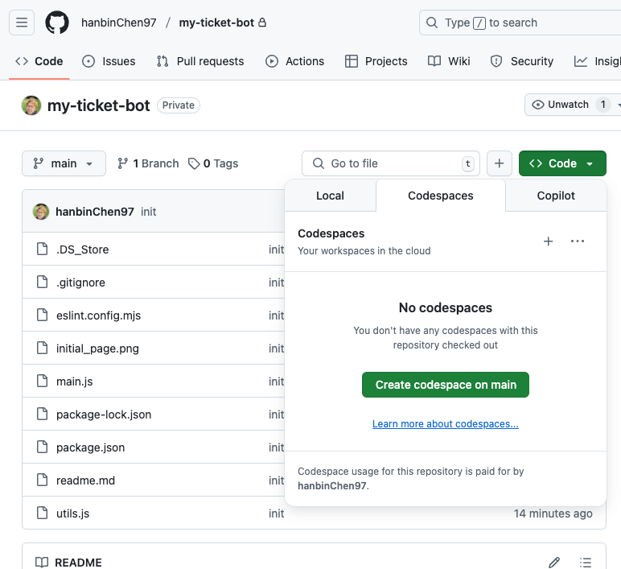
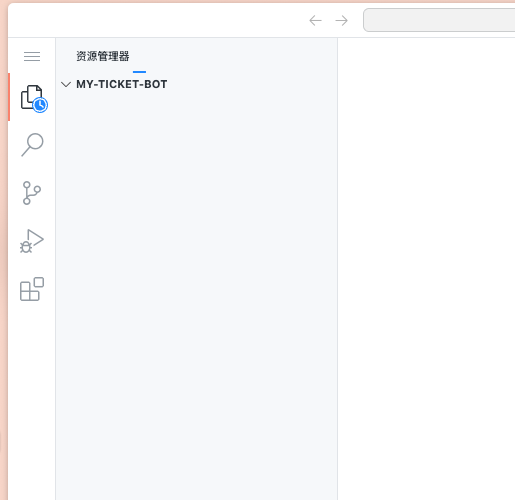

# 票务自动抢票机器人项目说明

## 项目概述

这个项目是一个基于Playwright的自动化票务抢票工具，可以模拟用户在票务网站上的操作，包括点击按钮、填写表单和提交请求，从而实现自动抢票功能。

## 功能特点

- 自动访问目标票务网站
- 模拟用户点击操作
- 自动填写表单信息
- 处理页面跳转和等待
- 提供丰富的配置选项
- 包含异常处理机制
- 支持定时抢票功能
- 支持添加银行卡号到个人信息

## 项目结构

```
my-ticket-bot/
├── config.js.example # 配置文件示例（需复制为 config.js 并修改）
├── utils.js        # 工具函数，包含等待元素、点击元素等功能
├── main.js         # 主程序，实现抢票逻辑
└── readme.md       # 项目说明文档
```

## 工作流程

1. **配置阶段**：
   - 在`config.js`中设置目标网站和相关参数
   - 配置浏览器启动选项（如无头模式、视口大小等）
   - 设置表单数据和按钮选择器

2. **执行阶段**：
   - 启动浏览器实例
   - 访问目标票务网站
   - 按照预设流程点击按钮、导航页面
   - 填写并提交表单信息
   - 处理提交结果

3. **结束阶段**：
   - 完成抢票流程
   - 关闭浏览器
   - 输出执行结果

## 技术栈

- Node.js
- Playwright (用于浏览器自动化)

## 安装指南

1. 克隆仓库：
```bash
git clone https://github.com/yourusername/my-ticket-bot.git
cd my-ticket-bot
```

2. 安装依赖：
```bash
npm install
```

3. 安装Playwright浏览器：
```bash
npx playwright install chromium
```

## 使用方法

1. **配置文件设置**：
   - 将 `config.js.example` 复制为 `config.js`：
   ```bash
   cp config.js.example config.js
   ```
   - 编辑 `config.js` 文件，将示例个人信息替换为您自己的信息：
   ```javascript
   userInfo: {
     gender: '您的性别', // männlich（男）或 weiblich（女）
     firstName: '您的名',  // 不要保留示例中的 "Max"
     lastName: '您的姓',   // 不要保留示例中的 "Jemand"
     address: '您的地址',
     zipCity: '您的邮编和城市',
     status: '您的身份状态', // 例如：S-RWTH 表示 RWTH的学生
     studentId: '您的学号',
     email: '您的邮箱',
     phone: '您的电话',
     acceptTerms: true,
     bankCardNumber: '您的银行卡号', // 新增字段
   },
   ```
   - 如需要，也可修改其他配置项

2. 运行程序：
```bash
node main.js
```

## 非程序员用户指南：如何使用本工具

如果您不是程序员，不必担心！下面是一个简单的操作指南，帮助您访问并运行这个抢票工具。

### 访问GitHub仓库

**创建GitHub账号**（如果您还没有）

### 使用GitHub Codespaces（无需安装任何软件）

Codespaces是GitHub提供的云端开发环境，您可以直接在浏览器中运行程序，无需在电脑上安装任何软件。

1. **启动Codespace**：
   - 在仓库页面上，点击绿色的"Code"按钮
   - 选择"Codespaces"选项卡
   - 点击"Create codespace on main"按钮
   - 等待几分钟，系统会为您创建一个在线工作环境

   
   

2. **设置配置文件**：
   - 当Codespace加载完成后，您会看到一个类似VS Code的编辑器界面
   - 在左侧文件列表中，找到并右键点击`config.js.example`文件
   - 选择"复制"
   - 然后在同一位置右键，选择"粘贴"
   - 将新文件重命名为`config.js`（去掉.example后缀）
   - 双击打开`config.js`文件
   - 修改其中的个人信息（替换Max Jemand等示例信息为您自己的信息）

3. **安装必要组件**：
   - 在界面底部，您会看到一个终端窗口
   - 点击终端，输入以下命令并按回车：
     ```
     npm install
     ```
   - 等待安装完成后，再输入：
     ```
     npx playwright install chromium
     ```

4. **运行抢票程序**：
   - 在终端中输入：
     ```
     node main.js
     ```
   - 程序会自动运行并尝试为您抢票

5. **查看结果**：
   - 由于在Codespace中运行，您看不到浏览器界面
   - 程序会在终端中显示运行状态和结果
   - 您也可以在`saved_pages`文件夹中查看保存的页面截图

### 常见问题解答

**问题：我看不到浏览器界面，怎么知道程序在正常运行？**  
回答：在`config.js`文件中，`browser.headless`设置为`true`表示浏览器在后台运行。程序会在终端显示运行状态，也会在`saved_pages`文件夹保存页面截图。

**问题：如果抢票失败了怎么办？**  
回答：检查终端输出的错误信息，可能是配置有误或目标网站结构发生了变化。您可以联系我提供帮助。

**问题：我需要修改什么配置才能抢到票？**  
回答：主要需要修改`config.js`中的`userInfo`部分，填入您的个人信息，以及`targetCourse`部分，设置您想要预订的课程时间。

### 注意事项

- 使用本工具时请遵守相关网站的使用条款
- 请不要过于频繁地运行程序，以免被网站封禁
- 请勿将含有您个人信息的配置文件分享给他人
- 如遇到任何问题，欢迎联系我寻求帮助

## 调试技巧

- 在`config.js`中设置`headless: false`可以看到浏览器的运行过程
- 使用`console.log()`在关键步骤输出程序状态
- 启用`devtools: true`选项可以打开开发者工具进行调试

## 注意事项

- 使用本工具时请遵守目标网站的使用条款
- 过于频繁的请求可能会导致IP被封禁
- 建议在非高峰时段测试程序
- 实际抢票时可能需要根据具体网站调整选择器和流程
- **个人信息安全**：请勿将含有真实个人信息的配置文件分享或上传到公共仓库
- **重要提醒**：首次运行前必须创建并配置 `config.js` 文件，不要直接使用示例文件

## 许可证

MIT
